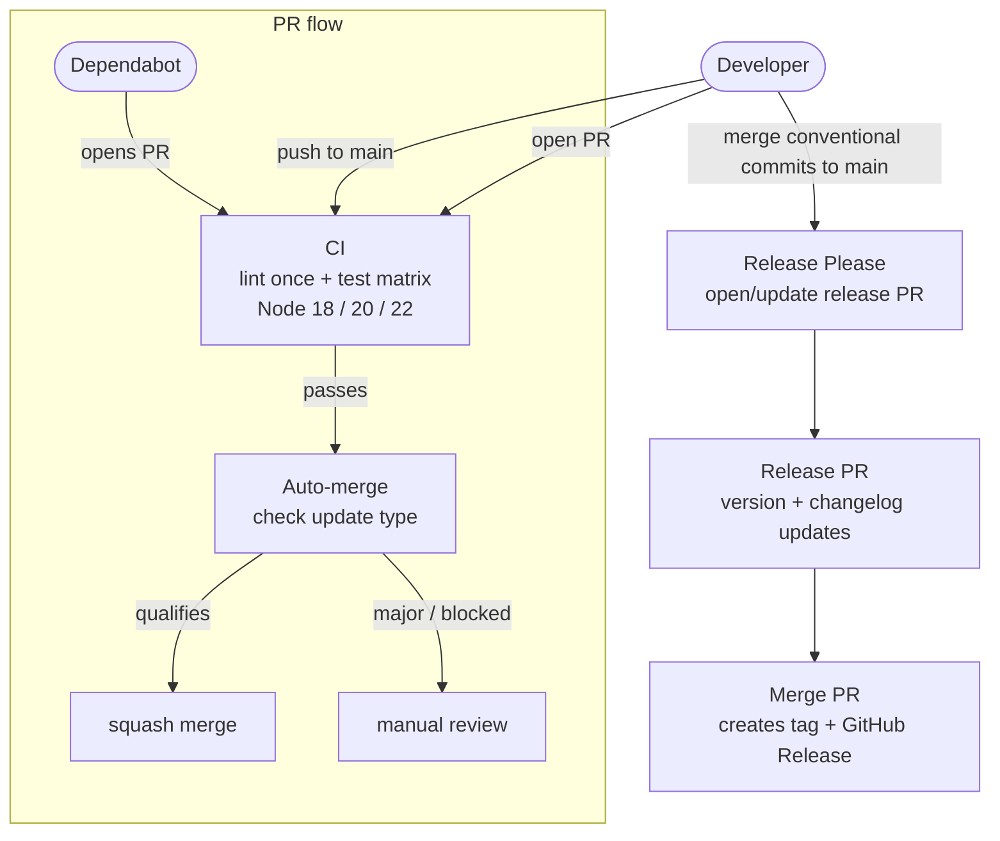

# GitHub Actions

Three workflows automate testing, dependency updates, and releases.

## Workflows

### CI (`ci.yml`)

Runs on every push or pull request to `main` (skips markdown and docs changes), and can be triggered manually via `workflow_dispatch`.

- Cancels superseded runs for the same branch or pull request
- Runs linting once on Node.js 22
- Runs tests on Node.js 18, 20, and 22
- Uses npm dependency caching via `actions/setup-node`

### Auto-merge Dependabot (`auto-merge.yml`)

Runs on Dependabot pull request updates and enables GitHub auto-merge when the update qualifies:

| Dependency type | Update type | Auto-merge? |
|-----------------|-------------|-------------|
| Production      | patch       | Yes         |
| Production      | minor (security) | Yes    |
| Development     | minor or below | Yes      |
| Any             | major       | No          |

Branch protection still controls the final merge. This workflow only enables auto-merge for allowed updates.

### Release Please (`release-please.yml`)

Runs on code changes pushed to `main` and maintains the release PR.

- Creates or updates a Release Please PR from conventional commits
- Updates `CHANGELOG.md`, `package.json`, `package-lock.json`, and `io-package.json`
- Creates the Git tag and GitHub Release when the release PR is merged
- Supports an optional `RELEASE_PLEASE_TOKEN` secret so release PRs can trigger normal downstream checks

If `RELEASE_PLEASE_TOKEN` is not configured, the workflow falls back to `GITHUB_TOKEN`.

---

## Flow

---

## Creating a Release

See [releasing.md](releasing.md) for the step-by-step release process.
