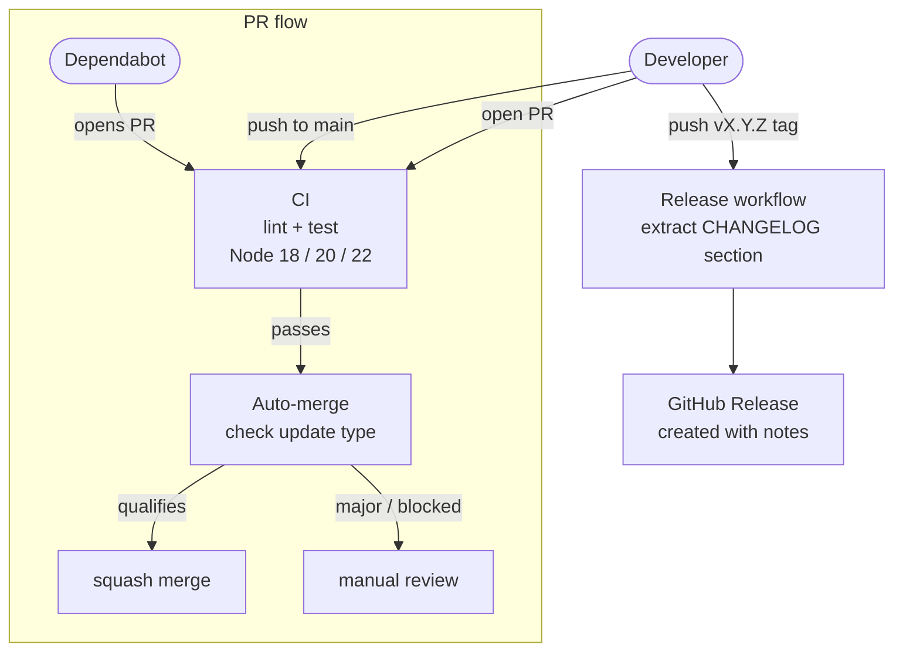

# GitHub Actions

Three workflows automate testing, dependency updates, and releases.

## Workflows

### CI (`ci.yml`)

Runs on every push or pull request to `main` (skips markdown and docs changes), and can be triggered manually via `workflow_dispatch`.

- Installs dependencies (`npm ci`)
- Runs linting (`npm run lint`)
- Runs tests (`npm test`)
- Matrix: Node.js 18, 20, 22

### Auto-merge Dependabot (`auto-merge.yml`)

Runs on every pull request. If the author is `dependabot[bot]`, it auto-merges the PR based on update type:

| Dependency type | Update type | Auto-merge? |
|-----------------|-------------|-------------|
| Production      | patch       | Yes         |
| Production      | minor (security) | Yes    |
| Development     | minor or below | Yes      |
| Any             | major       | No          |

### Release (`release.yml`)

Triggered when a `v*` tag is pushed. Extracts the changelog section for that version from `CHANGELOG.md` and creates a GitHub Release with those notes.

---

## Flow

---

## Creating a Release

See [releasing.md](releasing.md) for the step-by-step release process.
